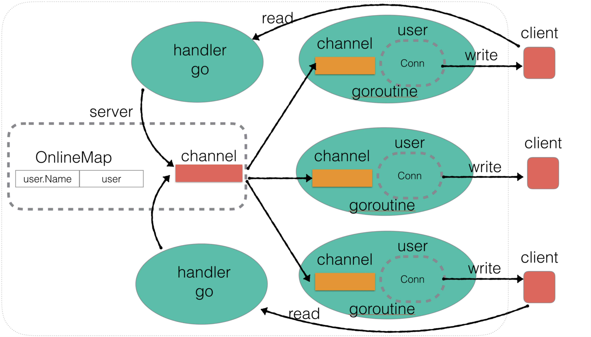

## Go 简易即时通讯（Instant Message，IM）

Go 实现简易即时通讯项目，项目来源于刘丹冰Aceld的 Go 语言课程

## 项目架构

## 实现功能

### 1，Server

创建 Socket，Listen()，不断 Accept()，并 go handler() 处理对应连接

### 2，用户上线

Server，Go routine 监听广播消息通道，一旦有消息就广播给全部在线用户的消息通道

添加到 Server 的 OnlineMap 中，并广播消息

注意：Map 不是并发安全，在操作前加锁

### 3，用户消息广播

go conn.Read(buf) 接受用户发送的消息，处理后，广播

### 4，用户业务层封装

### 5，在线用户查询

DoMessage()，处理 who 指令，遍历 OnlineMap，结果写回

### 6，修改用户名

DoMessage()，处理 rename|xxx 指令，更新 OnlineMap

### 7，超时强踢功能

有消息向 channel 写 true

select，case 超时，关闭连接

### 8，私聊功能

DoMessage()，处理 to|xxx | xxx 指令，根据用户名向其通道单独发送消息

### 9，Client

NewClient，go 监听响应

run，处理不同模式：公聊、私聊、更新用户名...
